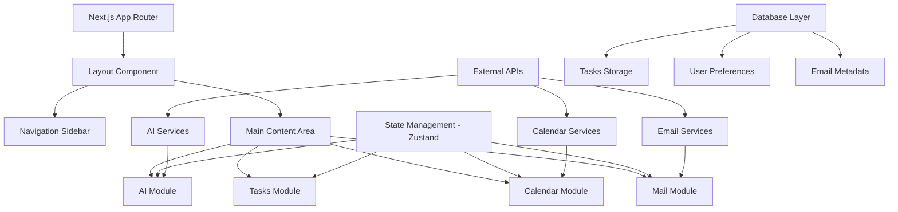

# Design Document

## Overview

The productivity platform will be built as a modern web application using Next.js 14 with the App Router, TypeScript, and Tailwind CSS. The architecture follows a modular design pattern with clear separation between the four main modules: AI Assistant, Task Management, Calendar, and Email. The application emphasizes performance, accessibility, and a polished user experience through careful component design and state management.

## Architecture

### High-Level Architecture



### Technology Stack

- **Frontend Framework**: Next.js 14 with App Router and TypeScript
- **Styling**: Tailwind CSS with custom design tokens
- **UI Components**: shadcn/ui component library
- **State Management**: Zustand for global state, React Query for server state
- **Drag & Drop**: @dnd-kit/core with @dnd-kit/sortable
- **Database**: PostgreSQL with Prisma ORM
- **Authentication**: NextAuth.js with OAuth providers
- **API Integration**: Custom API routes for external services

## Components and Interfaces

### Core Layout Structure

```typescript
interface AppLayoutProps {
  children: React.ReactNode;
}

interface NavigationItem {
  id: string;
  label: string;
  icon: React.ComponentType;
  href: string;
  isActive: boolean;
}

interface SidebarProps {
  items: NavigationItem[];
  isCollapsed: boolean;
  onToggleCollapse: () => void;
}
```

### AI Assistant Module

```typescript
interface ChatMessage {
  id: string;
  content: string;
  role: 'user' | 'assistant';
  timestamp: Date;
  metadata?: {
    actions?: AIAction[];
    references?: Reference[];
  };
}

interface AIAction {
  type: 'create_task' | 'schedule_event' | 'summarize_emails';
  payload: any;
  status: 'pending' | 'completed' | 'failed';
}

interface ChatInterfaceProps {
  messages: ChatMessage[];
  onSendMessage: (content: string) => void;
  onExecuteAction: (action: AIAction) => void;
  isLoading: boolean;
}
```

### Task Management Module

```typescript
interface Task {
  id: string;
  title: string;
  description?: string;
  estimatedDuration: number; // in minutes
  status: 'someday' | 'scheduled' | 'completed' | 'overdue';
  scheduledDate?: Date;
  scheduledTime?: string;
  tags: string[];
  priority: 'low' | 'medium' | 'high';
  createdAt: Date;
  updatedAt: Date;
}

interface WeeklyTimelineProps {
  tasks: Task[];
  currentWeek: Date;
  onTaskMove: (taskId: string, newDate: Date, newTime?: string) => void;
  onWeekChange: (direction: 'prev' | 'next') => void;
  showPastDays: boolean;
}

interface TimeBlockingSidebarProps {
  todayTasks: Task[];
  timeSlots: TimeSlot[];
  onTaskSchedule: (taskId: string, timeSlot: string) => void;
}
```

### Calendar Module

```typescript
interface CalendarEvent {
  id: string;
  title: string;
  description?: string;
  startTime: Date;
  endTime: Date;
  source: 'internal' | 'google' | 'outlook' | 'icloud';
  attendees?: string[];
  location?: string;
}

interface CalendarViewProps {
  events: CalendarEvent[];
  tasks: Task[];
  viewType: 'day' | 'week' | 'month';
  currentDate: Date;
  onEventMove: (eventId: string, newStart: Date, newEnd: Date) => void;
  onTaskSchedule: (taskId: string, date: Date, time: string) => void;
}
```

### Email Module

```typescript
interface EmailMessage {
  id: string;
  subject: string;
  sender: EmailAddress;
  recipients: EmailAddress[];
  body: string;
  timestamp: Date;
  isRead: boolean;
  isStarred: boolean;
  threadId: string;
  attachments: Attachment[];
  internalComments: InternalComment[];
}

interface InternalComment {
  id: string;
  content: string;
  author: User;
  timestamp: Date;
  emailId: string;
}

interface MailViewProps {
  emails: EmailMessage[];
  selectedEmail?: EmailMessage;
  mailboxes: Mailbox[];
  onEmailSelect: (emailId: string) => void;
  onConvertToTask: (email: EmailMessage) => void;
  onAddComment: (emailId: string, content: string) => void;
}
```

## Data Models

### Database Schema

```sql
-- Users table
CREATE TABLE users (
  id UUID PRIMARY KEY DEFAULT gen_random_uuid(),
  email VARCHAR(255) UNIQUE NOT NULL,
  name VARCHAR(255) NOT NULL,
  avatar_url TEXT,
  preferences JSONB DEFAULT '{}',
  created_at TIMESTAMP DEFAULT NOW(),
  updated_at TIMESTAMP DEFAULT NOW()
);

-- Tasks table
CREATE TABLE tasks (
  id UUID PRIMARY KEY DEFAULT gen_random_uuid(),
  user_id UUID REFERENCES users(id) ON DELETE CASCADE,
  title VARCHAR(500) NOT NULL,
  description TEXT,
  estimated_duration INTEGER DEFAULT 60,
  status VARCHAR(20) DEFAULT 'someday',
  scheduled_date DATE,
  scheduled_time TIME,
  tags TEXT[] DEFAULT '{}',
  priority VARCHAR(10) DEFAULT 'medium',
  created_at TIMESTAMP DEFAULT NOW(),
  updated_at TIMESTAMP DEFAULT NOW()
);

-- Calendar events table
CREATE TABLE calendar_events (
  id UUID PRIMARY KEY DEFAULT gen_random_uuid(),
  user_id UUID REFERENCES users(id) ON DELETE CASCADE,
  external_id VARCHAR(255),
  title VARCHAR(500) NOT NULL,
  description TEXT,
  start_time TIMESTAMP NOT NULL,
  end_time TIMESTAMP NOT NULL,
  source VARCHAR(20) NOT NULL,
  location TEXT,
  attendees JSONB DEFAULT '[]',
  created_at TIMESTAMP DEFAULT NOW(),
  updated_at TIMESTAMP DEFAULT NOW()
);

-- Email messages table
CREATE TABLE email_messages (
  id UUID PRIMARY KEY DEFAULT gen_random_uuid(),
  user_id UUID REFERENCES users(id) ON DELETE CASCADE,
  external_id VARCHAR(255) NOT NULL,
  thread_id VARCHAR(255) NOT NULL,
  subject VARCHAR(500) NOT NULL,
  sender JSONB NOT NULL,
  recipients JSONB NOT NULL,
  body TEXT NOT NULL,
  timestamp TIMESTAMP NOT NULL,
  is_read BOOLEAN DEFAULT FALSE,
  is_starred BOOLEAN DEFAULT FALSE,
  source VARCHAR(20) NOT NULL,
  created_at TIMESTAMP DEFAULT NOW()
);

-- Internal comments table
CREATE TABLE internal_comments (
  id UUID PRIMARY KEY DEFAULT gen_random_uuid(),
  email_id UUID REFERENCES email_messages(id) ON DELETE CASCADE,
  user_id UUID REFERENCES users(id) ON DELETE CASCADE,
  content TEXT NOT NULL,
  created_at TIMESTAMP DEFAULT NOW()
);
```

### State Management Structure

```typescript
// Zustand store interfaces
interface TaskStore {
  tasks: Task[];
  currentWeek: Date;
  showPastDays: boolean;
  selectedTask?: Task;
  
  // Actions
  addTask: (task: Omit<Task, 'id' | 'createdAt' | 'updatedAt'>) => void;
  updateTask: (id: string, updates: Partial<Task>) => void;
  deleteTask: (id: string) => void;
  moveTask: (id: string, newDate: Date, newTime?: string) => void;
  setCurrentWeek: (date: Date) => void;
  togglePastDays: () => void;
}

interface CalendarStore {
  events: CalendarEvent[];
  viewType: 'day' | 'week' | 'month';
  currentDate: Date;
  connectedServices: CalendarService[];
  
  // Actions
  syncCalendars: () => Promise<void>;
  addEvent: (event: Omit<CalendarEvent, 'id'>) => void;
  updateEvent: (id: string, updates: Partial<CalendarEvent>) => void;
  setViewType: (type: 'day' | 'week' | 'month') => void;
  setCurrentDate: (date: Date) => void;
}

interface EmailStore {
  emails: EmailMessage[];
  selectedEmail?: EmailMessage;
  mailboxes: Mailbox[];
  connectedAccounts: EmailAccount[];
  
  // Actions
  syncEmails: () => Promise<void>;
  selectEmail: (id: string) => void;
  markAsRead: (id: string) => void;
  addInternalComment: (emailId: string, content: string) => void;
  convertToTask: (email: EmailMessage) => Task;
}

interface AIStore {
  messages: ChatMessage[];
  isLoading: boolean;
  
  // Actions
  sendMessage: (content: string) => Promise<void>;
  executeAction: (action: AIAction) => Promise<void>;
  clearHistory: () => void;
}
```

## Error Handling

### Error Boundaries and Fallbacks

```typescript
interface ErrorBoundaryState {
  hasError: boolean;
  error?: Error;
  errorInfo?: ErrorInfo;
}

class ModuleErrorBoundary extends Component<
  { children: ReactNode; moduleName: string },
  ErrorBoundaryState
> {
  // Catch errors in specific modules and provide graceful fallbacks
}

// API Error Handling
interface APIError {
  code: string;
  message: string;
  details?: any;
}

const handleAPIError = (error: APIError) => {
  switch (error.code) {
    case 'CALENDAR_SYNC_FAILED':
      // Show retry option with exponential backoff
      break;
    case 'EMAIL_AUTH_EXPIRED':
      // Redirect to re-authentication flow
      break;
    case 'TASK_SAVE_FAILED':
      // Store locally and retry when online
      break;
    default:
      // Generic error handling
  }
};
```

### Offline Handling

```typescript
interface OfflineStore {
  isOnline: boolean;
  pendingActions: PendingAction[];
  
  // Actions
  queueAction: (action: PendingAction) => void;
  syncPendingActions: () => Promise<void>;
  setOnlineStatus: (status: boolean) => void;
}

// Service Worker for caching
const cacheStrategy = {
  tasks: 'cache-first',
  calendar: 'network-first',
  emails: 'network-first',
  static: 'cache-first'
};
```

## Testing Strategy

### Unit Testing

- **Components**: Test all UI components with React Testing Library
- **Hooks**: Test custom hooks with @testing-library/react-hooks
- **Stores**: Test Zustand stores with mock implementations
- **Utilities**: Test helper functions and data transformations

### Integration Testing

- **Drag & Drop**: Test dnd-kit interactions with user event simulation
- **API Integration**: Test external service connections with MSW
- **State Synchronization**: Test cross-module state updates

### End-to-End Testing

```typescript
// Playwright test scenarios
describe('Task Management Flow', () => {
  test('should create and schedule task via drag and drop', async ({ page }) => {
    // Test complete user workflow
  });
  
  test('should convert email to task', async ({ page }) => {
    // Test email-to-task conversion flow
  });
  
  test('should sync calendar events', async ({ page }) => {
    // Test calendar synchronization
  });
});
```

### Performance Testing

- **Bundle Analysis**: Monitor bundle size with @next/bundle-analyzer
- **Core Web Vitals**: Track LCP, FID, and CLS metrics
- **Memory Usage**: Profile component re-renders and memory leaks
- **API Response Times**: Monitor external service performance

## Security Considerations

### Authentication & Authorization

```typescript
// NextAuth.js configuration
const authOptions: NextAuthOptions = {
  providers: [
    GoogleProvider({
      clientId: process.env.GOOGLE_CLIENT_ID!,
      clientSecret: process.env.GOOGLE_CLIENT_SECRET!,
      authorization: {
        params: {
          scope: 'openid email profile https://www.googleapis.com/auth/calendar https://www.googleapis.com/auth/gmail.readonly'
        }
      }
    }),
    // Additional providers...
  ],
  callbacks: {
    jwt: async ({ token, account }) => {
      // Store refresh tokens securely
    },
    session: async ({ session, token }) => {
      // Attach user permissions
    }
  }
};
```

### Data Protection

- **Encryption**: Encrypt sensitive data at rest using AES-256
- **API Security**: Implement rate limiting and request validation
- **CSRF Protection**: Use NextAuth.js built-in CSRF protection
- **XSS Prevention**: Sanitize user inputs and use Content Security Policy

### Privacy Compliance

- **Data Minimization**: Only store necessary user data
- **Consent Management**: Implement clear consent flows for external integrations
- **Data Retention**: Implement automatic data cleanup policies
- **Export/Delete**: Provide user data export and deletion capabilities